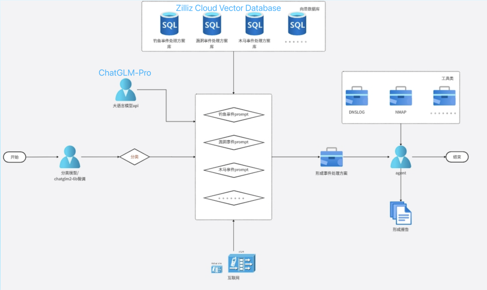
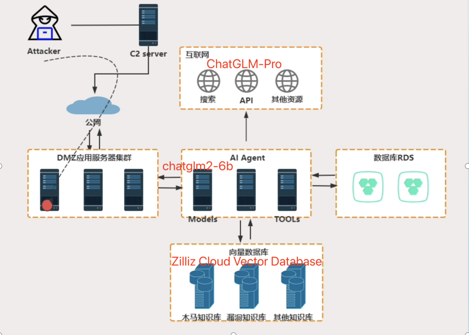
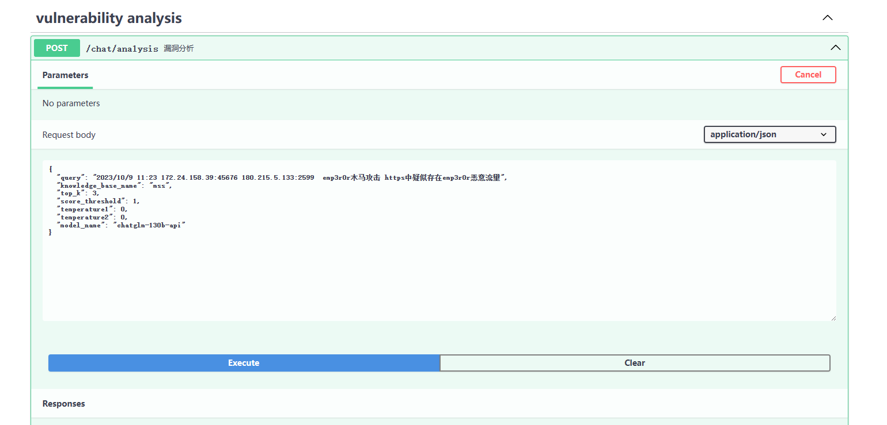
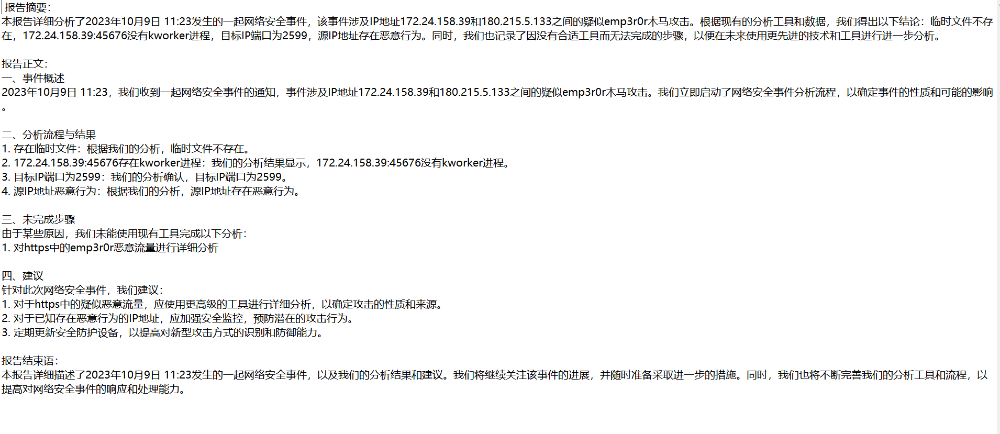
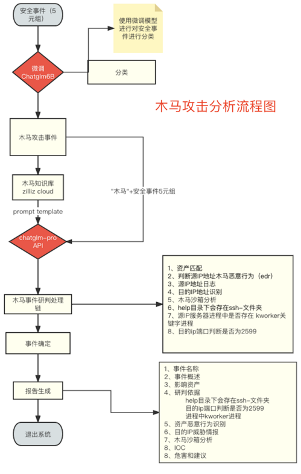
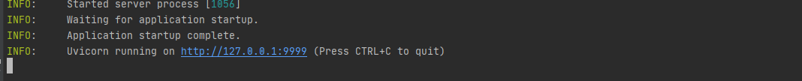
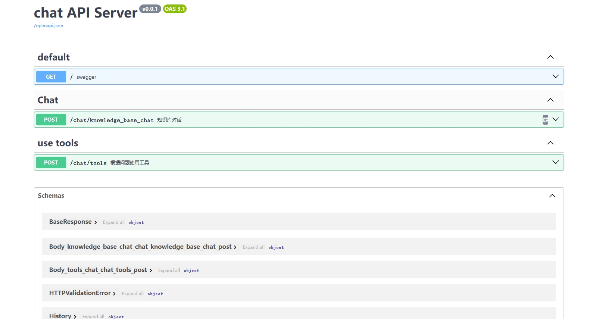

# autoMSS

## 项目介绍

AutoMSS 是基于AI Agent实现的针对安全事件自动化分析研判的系统。本项目依托于 [langchain](https://github.com/langchain-ai/langchain) 框架支持通过基于 [FastAPI](https://github.com/tiangolo/fastapi) 提供的 API 调用服务。

## 项目架构

### 分析架构
首先，从开始部分输入安全事件记录， 由经过微调后的Chatglm2-6B的微调模型对该事件进行分类。

然后，根据分类后的结果，使用对应的prompt模板对ChatGLM-pro大模型进行请求，大模型根据向量库中的知识以及自身的逻辑推理能力，生成该类事件的分析研判流程。

接着，Agent 根据事件的分析研判流程通过调用工具、访问大模型、请求网络等方式来对该事件进行研判。

最后，根据分析的结果输出研判结论以及形成对应的研判报告。


### 部署架构
该部署架构省去了大部分的安全防护设备，也简化了数据获取的过程，实际情况可能会更复杂。可以根据自身实际的环境进行响应的调整，比如，从xdr或者态势感知中获取数据。


## Demo

本项目使用了fastchat框架，在启动服务后对访问端口(127.0.0.1:9999/chat/analysis)发送的数据即可。

测试样例中输入格式为：时间   源IP服务器地址和端口   目的IP地址和端口  事件名称  事件内容

如：2023/10/9 11:23 172.24.158.39:45676 180.215.5.133:2599  emp3r0r木马攻击 https中疑似存在emp3r0r恶意流量 




在项目本地中docs目录下会生成对应日期的研判报告



样例中，木马攻击流程图如下：



## 项目运行

### 微调模型相关

本案例使用了由[智谱](https://www.zhipuai.cn/)提供的微调模型平台，如需使用本地部署微调模型需要另外配置。

本案例期望的微调模型输出格式如下：

输出：事件名称  事件类型，如：(emp3r0r木马攻击   木马攻击)

```python
async def classify_model(query: str = Body(..., description="用户输入")):
    """
    实现微调模型的调用，完成对五元组的初次分类
    """
    url = 'http:zhipu'
    # 请求头
    headers = {
        'Content-Type': 'application/json'}

    data = {
        "prompt": query
    }
    # 将Python字典转换为JSON字符串
    json_data = json.dumps(data)
    # 发送POST请求
    response = requests.post(url, headers=headers, data=json_data)
    response = response.json()
    answer_6b, bigclass = response["history"][0][0]['response'].split(" ")
    # answer_6b=PROMPT3(response['response'])

    #print(answer_6b)
    return answer_6b, bigclass
```

### 环境安装

使用 pip 安装依赖

```
pip install -r requirements.txt
```

### 修改配置文件

```shell
cd autoMSS
vim configs/server_config.py
```

```python
#找到DEFAULT_BIND_HOST，可以把该地址修改为其他地址，修改后注意与configs/model_config.py文件保持一致
DEFAULT_BIND_HOST = "127.0.0.1"
# fastchat openai_api server
FSCHAT_OPENAI_API = {
    "host": DEFAULT_BIND_HOST,
    "port": 8888,  # model_config.llm_model_dict中模型配置的api_base_url需要与这里一致。
}
```

```shell
vim configs/model_config.py #修改模型与向量数据库相关配置
```

```python
#把model_config.py里面的模型地址修改为本地地址或者api
#找到embedding_model_dict，把地址修改为本地模型地址，本样例使用m3e-base
embedding_model_dict = {
    "bge-base-zh": "/data/sdh/embedding/m3e-base",
}
#找到llm_model_dict，把地址修改为模型本地地址，或直接增加模型
#api_base_url
llm_model_dict = {
    #设置本地模型样例，设置后可以使用该模型
    # "chatglm2-6b": {
    #     "local_model_path": "chatglm-6b",
    #     "api_base_url": "http://localhost:8888/v1",
    #     "api_key": "EMPTY"
    # },
    "chatglm2-6b": {
        "api_base_url": "http://127.0.0.1:8888/v1",
        "api_key": os.getenv("zhupu_API_KEY"),
        "provider": "ChatGLMWorker",
        "version": "chatglm_pro"
    },
    "chatglm-130b-api": {
        "api_base_url": "http://127.0.0.1:7777/v1",
        "api_key": os.getenv("zhupu_API_KEY"),
        "provider": "ChatGLMWorker",
        "version": "chatglm_pro"
    }
}
# 指定使用的模型名
LLM_MODEL_6B = "chatglm2-6b"  #微调模型
LLM_MODEL_130B = "chatglm-130b-api"  #调用工具以及生成报告的模型
EMBEDDING_MODEL = "m3e-base"  #embedding模型

#本样例使用了由zilliz提供的云端向量数据库，在这里配置数据库相关信息
kbs_config = {
    "milvus": {
        "uri": "https://in01-397f12b4b52bc10.ali-cn-hangzhou.vectordb.zilliz.com.cn",
        "port": "port",
        "user": "db_admin",
        "password": "password",
        "secure": False,
    }}
```

### 生成向量数据库

我们需要将各种类型的网络安全知识文档保存在到autoMSS/knowledge/mss目录下

```shell
cd autoMSS/knowledge/mss
#在该地址保存需要生成知识向量库的所有文件
cd autoMSS
python server/milvus_kb_service.py
#运行脚本生成知识向量库
```

milvus_kb_service.py会自动将这些文档进行切分，embedding后，导入向量数据库中。

### 启动服务

```shell
#在项目地址运行
cd autoMSS
python startup.py -a
```

运行结果



访问对应端口(127.0.0.1:9999)即可



## 其他自定义

### prompt相关

在prompt_config.py文件中，可以修改PROMPT相关内容。

```shell
vim configs/prompt_config.py
```

在docs/prompt目录下有两个文档用来修改工具调用PROMPT

```shell
cd docs/prompt/
```

### 自定义工具设置

实现自定义函数再添加进configs/tools_config.py文件中的tools列表对应类型中

```python
@tool("tool1")
def check_files(text:str) -> str:
    """
        这个工具只能在检查源 IP 服务器是否会在路径下⽣成临时⽂件的时候使用\
        输入应该总是一个字符串格式的ip服务器，\
    """
    is_temp_files = check_temp_files(text, username, password)
    return f"存在临时文件: {is_temp_files}"
```
该函数的描述需要详细准确，LLM需要根据此描述来选取工具。

```python
tools = {
    "普通木马攻击": [check_files, check_kworker, check_2599, check_behavior, get_assests],
    "webshell攻击": [],
    "web漏洞攻击": [],
    "反序列化攻击": [],}
```

## 后续更新目标

1.目前是基于chatglm-pro模型实现与调用的，因为chatglm pro模型没有function call，不支持工具直接调用，所以该项目使用prompt实现对工具的调用，后续更新会使用chatglm3-6b等支持工具调用的模型。

2.支持更多场景的安全事件分析和研判。

3.开发对应的前端，更好的展示本项目。

4.优化RAG，使其能够更准确的对知识进行召回。

5.希望大家可以参与进来一起完善本项目。
